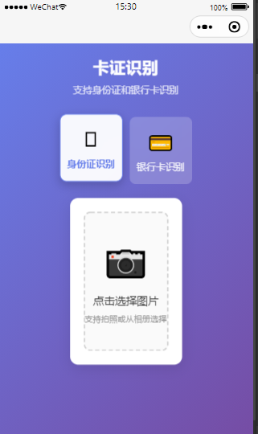
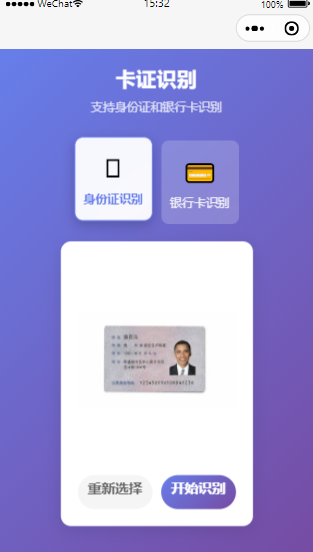
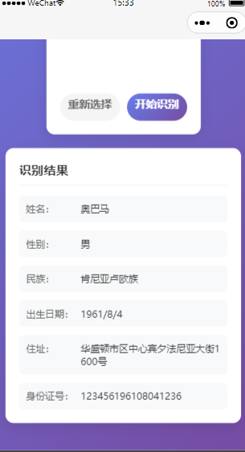
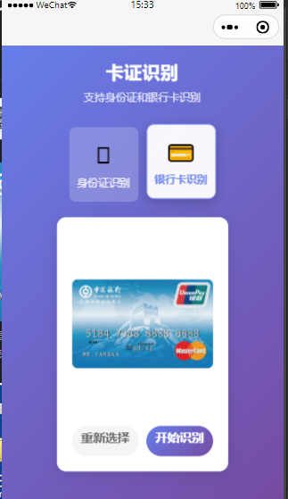
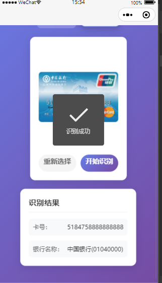

# 卡证识别微信小程序

基于微信云开发和腾讯云 OCR 的卡证识别小程序，支持身份证识别和银行卡识别功能。


## 🖼️ 项目展示

### 身份证识别





### 银行卡识别




## 功能特性

- ✅ 身份证识别：支持识别姓名、性别、民族、出生日期、住址、身份证号、签发机关、有效期限等信息
- ✅ 银行卡识别：支持识别卡号、银行名称、有效期等信息
- ✅ 美观的 UI 界面：现代化的渐变设计和流畅的交互体验
- ✅ 图片上传：支持拍照或从相册选择图片
- ✅ 云函数处理：使用腾讯云 OCR API 进行卡证识别

## 技术栈

- 微信小程序
- 微信云开发（云函数、云存储）
- 腾讯云 OCR 服务
- tencentcloud-sdk-nodejs

## 🚀 快速开始

### 环境要求

- 微信开发者工具
- 腾讯云账号（用于 OCR 服务）

### 配置腾讯云密钥

1. 登录 [腾讯云控制台](https://console.cloud.tencent.com/)
2. 进入"访问管理" → "访问密钥" → "API 密钥管理"
3. 创建密钥，获取 `SecretId` 和 `SecretKey`
4. 配置云函数环境变量

### 安装云函数依赖

```bash
# 进入云函数目录
cd cloudfunctions/idCardOCR
npm install

cd ../bankCardOCR
npm install
```

### 部署云函数

1. 在微信开发者工具中右键点击云函数文件夹
2. 选择"上传并部署：云端安装依赖"
3. 对 `idCardOCR` 和 `bankCardOCR` 都执行此操作

### 运行项目

1. 使用微信开发者工具打开项目
2. 开通云开发并创建云环境
3. 填入自己的 AppID
4. 点击"编译"按钮运行


